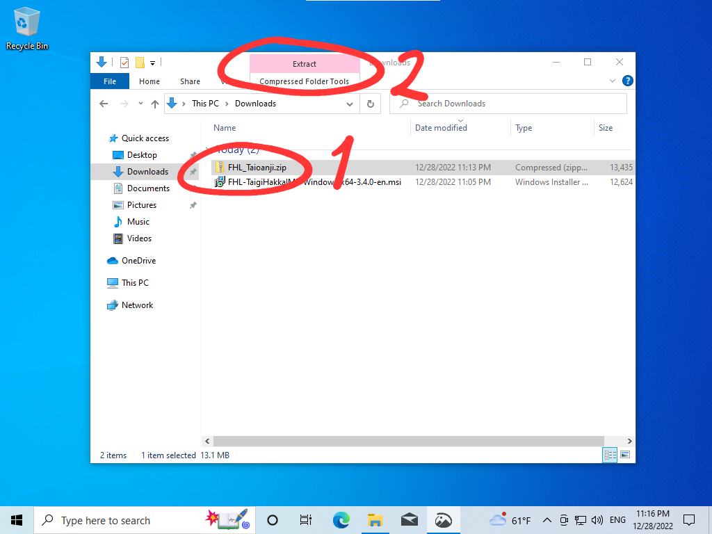
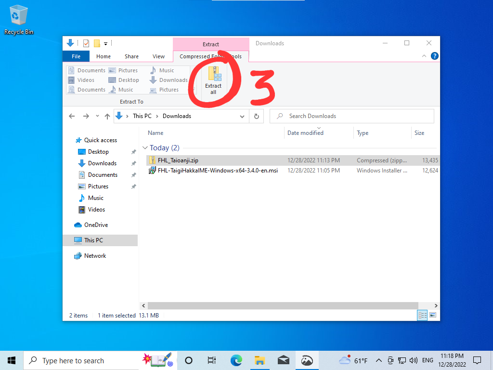
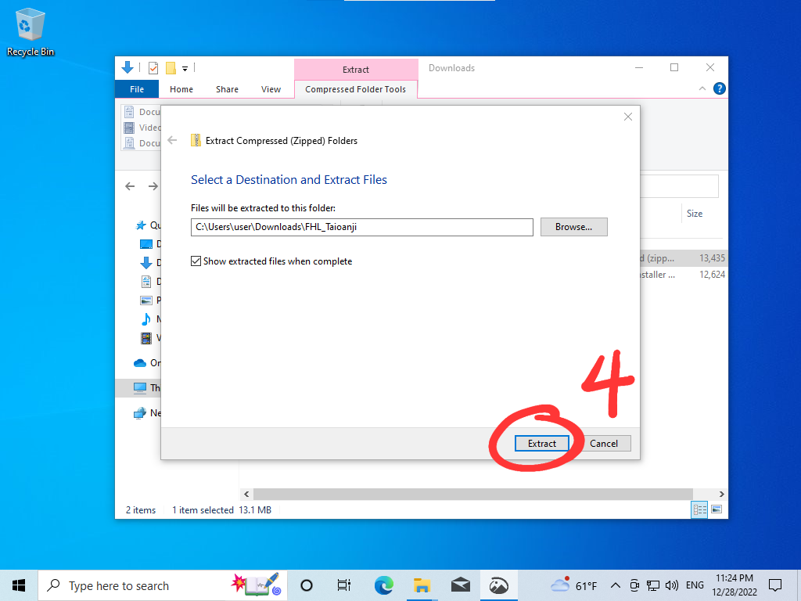
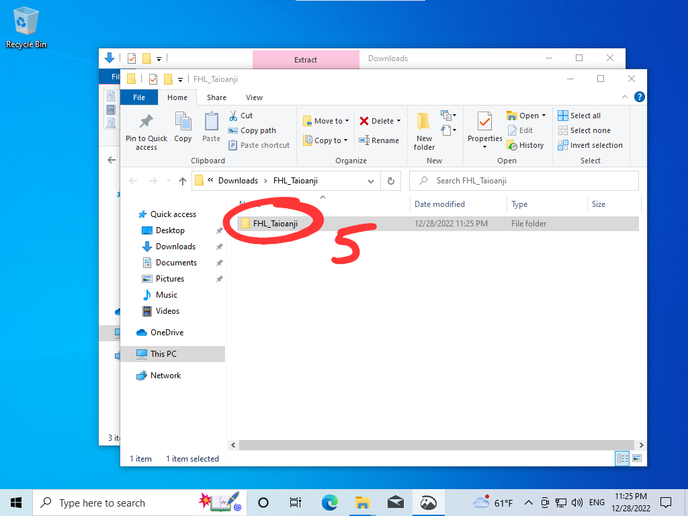
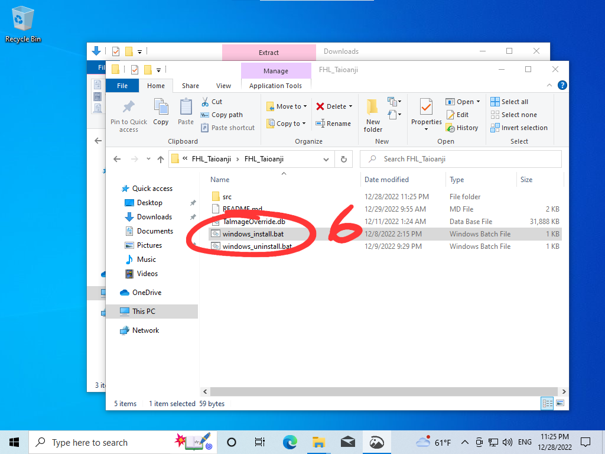
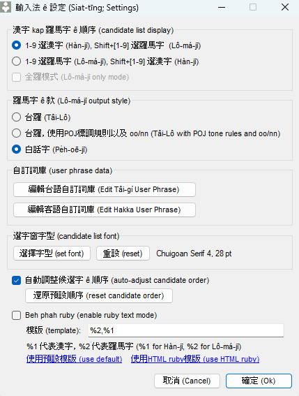
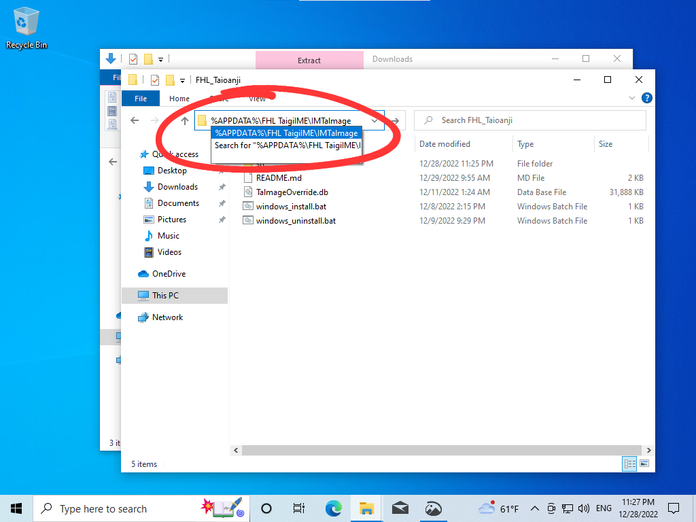
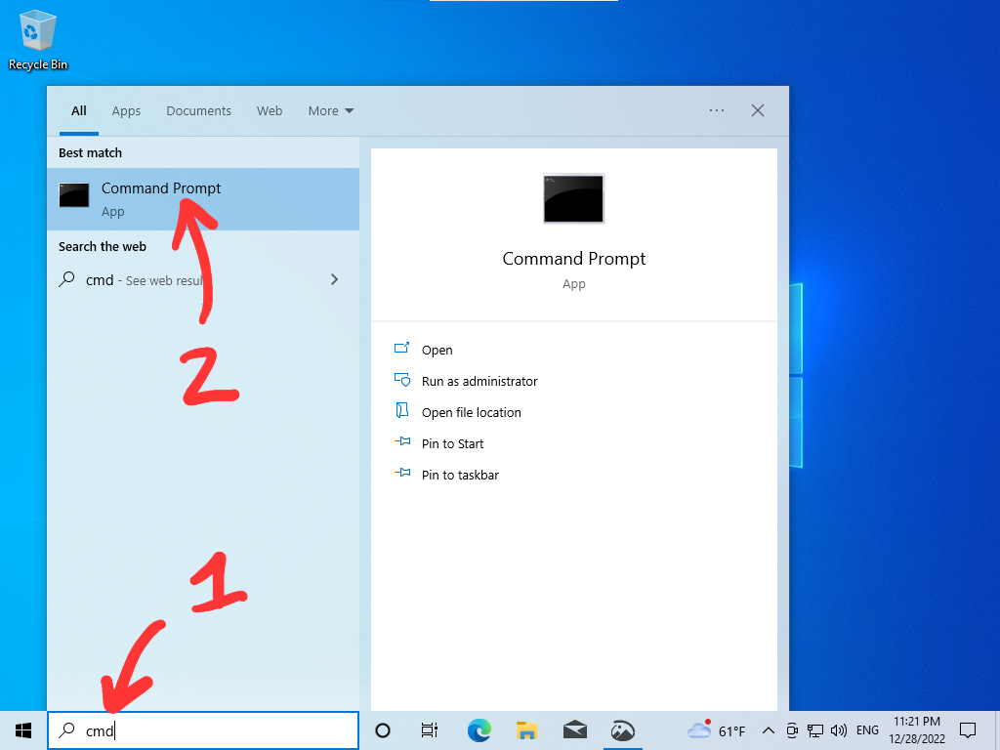
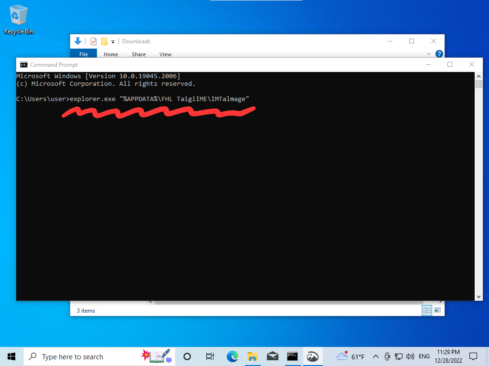
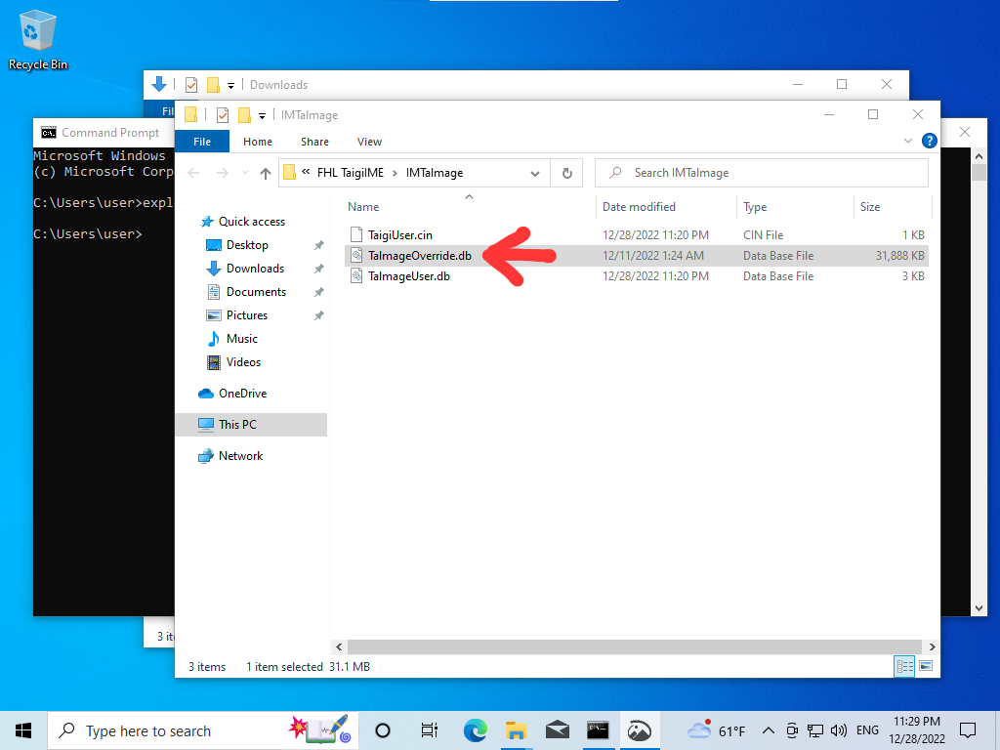

**[Lômájī pán soatbêngsu](README.lmj.md)**

# 信望愛 + 台灣字

這是一个 khah 新 ê [FHL Taigi-Hakka IME 信望愛台語客語輸入法](https://taigi.fhl.net/TaigiIME/)資料庫。資料庫有法度直接phahTOJ=無連字符ê白話字，koh有修改kài chē 漢字、白話字 ê 錯誤。

**最新版本 (2023-01-18): [FHL_Taioanji-v0.0.4.zip](https://github.com/sinbongai/toj/releases/download/v0.0.4/FHL_Taioanji-v0.0.4.zip)**

過去 ê 版本，請看 [`releases`](https://github.com/sinbongai/toj/releases)。

---

## 台灣字

台灣字 (TOJ) 是無連字符 ê 白話字。歡迎來[全民台灣字台文社](https://www.facebook.com/groups/3890458310987344)討論。

## Windows

### 安裝 (Install)

註：

- 你 ê 電腦需要有安裝[信望愛台語客語輸入法](https://taigi.fhl.net/TaigiIME/)。
- 若頭一 kái beh 安裝台灣字資料庫，免重開電腦。
- 若 beh 更新，請先重開電腦。

**1.** Tángló͘ siōng 新 ê `FHL_Taioanji-vX.Y.Z.zip`.

**2.** Chhi̍h `解壓縮 (Extract)`：



**3.** Chhi̍h `全部解壓縮 (Extract all)`：



**4.** Chhi̍h `解壓縮 (Extract)` 到一个資料夾：



**5.** Chhi̍h 資料夾 ka phah 開：



**6.** Chhi̍h `windows_install.bat` (chhi̍h 落去無反應是正常)



Ánne to̍h ē sái 開始使用。若 iáu 無台灣字，請重新開機，koh 試一 pái。

Ūi tio̍h phah 台灣字 khah 利便，輸入法 ê 設定做 1-9 選漢字：



---

### 刪除 (Uninstall)

**1.** 重新開機 / Restart。完成刪除 chìn 前，m̄ thang 切換 FHL 輸入法。
   
**2.** Chhi̍h `windows_uninstall.bat`

---

### 若有 tú tio̍h 問題：

若無法度裝 á 是刪，請手動 kā `TalmageOverride.db` 裝/刪。請 ē 記得 ta̍k pái **裝/刪 chìn 前 ài 重新開機。**

請手動 phah 開輸入法 ê 資料夾，kā 資料庫刪除，koh 重新開機 to̍h ē sái 得。

#### 1. Phah 開輸入法 ê 資料夾

Phah 開輸入法 ê 資料夾有 2 个法度：

1 (A). Tī `檔案總管 (explorer)` ê Folder Path 頂面 phah：

```
%APPDATA%\FHL TaigiIME\IMTalmage
```



**á 是**

1 (B). Chhōe `cmd` ka phah 開：



Kā `explorer.exe` phah 開，tio̍h 手 phah： `explorer.exe "%APPDATA%\FHL TaigiIME\IMTalmage"`



#### 2. Kā 資料庫刪除

刪 `TalmageOverride.db`:



---

## 蘋果 (Mac)

請 tángló͘ kah Windows 仝款 ê `FHL_Taioanji.zip`，koh 解壓縮到一个資料夾。

用搜尋 (Finder) chhōe `~/Library/Application Support/FHL TaigiIME/IMTalmage`。Kā `TalmageOverride.db` hē tī “IMTalmage” to̍h ē sái 得使用。

若beh刪除，kā `TalmageOverride.db` 刪除 to̍h ē sái 得。

## Developers

There's just a simple build script in `src/build.py`. You will need a CSV file with 4 columns:

```
1. id - a number
2. original lomaji - fully hyphenated as in the original FHL database
3. taioanji - with hyphens removed (either joined or spaced) as required
4. hanji - desired hanji output

Run the script and copy the output SQLite database `TalmageOverride.db` to the appropriate folder for your platform. To uninstall or modify, you must log out and log back in (or reboot) first.